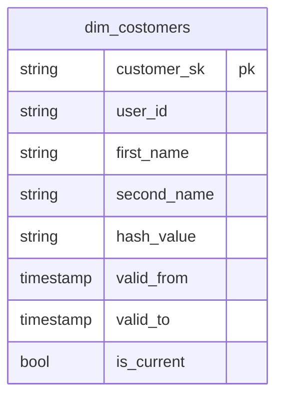

# 導入
データエンジニアの皆さん、ディメンショナルモデリングやってますか！？
私は、データモデリングをしてはなんか筋の良いデータモデリングができない悶々として日々を過ごしています。

データモデリング実装の中で、ディメンションテーブルの冪等性とソースデータの修正に伴い
過去データのバックフィルについて、非常に頭を悩まして自分なりの解を得たのでこのブログにその内容をしたためました。

# 対象者
- データエンジニア
- ディメンションテーブルに実装をしている方
- dbtを使ったデータモデリングをされている方

# 今回利用する技術
- Google Cloud BigQuery
- dbt-bigquery

# 今回実装するディメンションテーブル
ここで実装するディメンションテーブルは、SCD Type6になります。
SCD Typeについては以下が非常にわかりやすくまとめられているので参考にしてください。
https://data.gunosy.io/entry/dbt_snapshot_and_scd#SCD-Type-03-%E5%9F%BA%E7%A4%8E%E3%82%92%E5%AD%A6%E3%81%B6

実装するディメンションテーブルは、以下のスキーマを持ちます。

# 新規データインサートの実装
新規のデータと自己参照した現在の値に紐づくビジネスキーが持つ属性に差分を判定します。
新規のデータに差分がある場合のみ、ディメンションテーブルへ新規インサートします。
また、新規インサートするということはSCDに則ったデータ有効期限の更新を行います。
**イメージを書く**

# 再実行のシナリオ
では、再実行する場合を考えてみます。
再実行する場合に考えをめぐらしましょう。
- データの欠損が有ったがソースシステムで復元することができた
- ソースシステムにバグが含まれており一時的に誤った値が出力されていたがロジックを直すことで過去データ含め修正した
- ディメンションテーブルの実装に誤りが有った

この中で、エラー発行から現在までデータパイプライン全体を再実行して修正する誤りは、ディメンションテーブルの実装に誤りが有った場面だと考えられます。
それ以外の対応は、エラー、バグの程度によりますが該当するモデルの部分的な修正ができていれば十分だと考えられます。

# あれ?この再実行のシナリオだと壊れちゃうねー
ソースシステムの修正に伴い一部の過去の日付だけディメンションテーブルを再処理してみましょう。
**イメージを書く**
データの有効期限が再処理した過去分が最新と判断されちゃいますね。
これの原因は、何なんでしょうか？

ディメンションテーブルの新規データインサート向けのロジックで過去のデータアップデートしたためですね。

# これを回避するには？
端的言うと新規データインサートのロジックとは別に過去のデータアップデートのロジックを設けてあげるのが良いと考えられます。
**イメージを書く**

過去のデータアップデートに追加して欠損データの追加は処理観点で見ると自己参照テーブルの新規データ追加に当たるためそれも追加しましょう。

# 実装はこんな形になっていると良いと考える
最終的に、新規データインサートと再処理のロジックが別れてそれぞれ持ち以下のようになっていると形になっていると良いと考えられます。
**イメージを書く**

# まとめ
データモデリングを検討した実装に慣れると新規データインサートは、比較的簡単です。
そこに追加して、再処理の冪等性とソースデータの変更を考えておかないと後で再処理が必要となったときに
ディメンションテーブルのデータ有効期限の整合性を取るために処理日から現在までの再処理必要となり場合に
よっては大きなコストに繋がることも考えられます。

データモデリングの再処理について自分なり考えた解ですので効率の悪いところやそもそもの誤りも含まれるかと思っています。
ただ、これを起点に皆さんもデータモデリングの再処理に考えてもらったりこのブログで議論できればと思っているので何かしらコメントいただけますと幸いです。