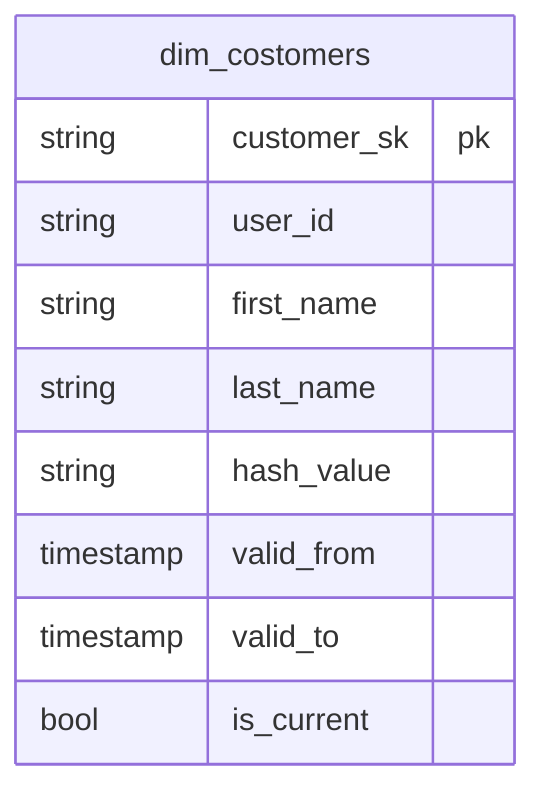

# 導入
データエンジニアの皆さん、ディメンショナルモデリングやってますか！？
私は、データモデリングをしてはなんか筋の良いデータモデリングができない悶々として日々を過ごしています。

データモデリング実装の中で、ディメンションテーブルの冪等性とソースデータの修正に伴い過去データのバックフィルについて、非常に頭を悩まして自分なりの解を得たのでこのブログにその内容をしたためました。

# 対象者
- データエンジニア
- ディメンションテーブルに実装をしている方
- dbtを使ったデータモデリングをされている方

# 今回利用する技術
- Google Cloud BigQuery
- dbt-bigquery

# 実装するディメンションテーブル
ここで実装するディメンションテーブルは、SCD Type6になります。
SCD Typeについては、以下が非常にわかりやすくまとめられているので参考にしてください。
https://data.gunosy.io/entry/dbt_snapshot_and_scd#SCD-Type-03-%E5%9F%BA%E7%A4%8E%E3%82%92%E5%AD%A6%E3%81%B6

サンプルに使うデータは、`jaffle-shop-classic` のCSVデータを利用します。
https://github.com/dbt-labs/jaffle-shop-classic/tree/main/seeds

実装するディメンションテーブルは、以下のスキーマを持ちます。


# 新規データインサートの実装
新規のデータと自己参照した現在の値に紐づくビジネスキーが持つ属性に差分を判定します。
ディメンションテーブルへ属性の差分がある新規データを抽出して、そのデータをSCDに則るためにデータ有効期限の情報を追加して現在のディメンションのデータを更新します。
この更新したデータが最終的にインサートするデータになります。

新規データインサートの処理イメージ


# 再実行のシナリオ
では、再実行へ考えを巡らしましょう。

再実行が発生するパターンについていくつか例を挙げてみました。
1. ソースシステムの変更に対してデータパイプラインの追随ができていない
2. ディメンションテーブルの実装に誤りが有った
3. データの欠損が有ったがソースシステムでその時点のデータを復元することができた

この中で、修正時点から現在までの修正が必要なのはデータパイプラインの修正が必要となる1. 2.になります。
それとは違い、ソースシステムの修正起因の再処理は、エラー、バグの程度によりますが該当するモデルの部分的な修正ができていれば十分だと考えられます。

# あれ?この再実行のシナリオだと壊れちゃうねー
ソースシステムの修正に伴い一部の過去の日付だけディメンションテーブルを再処理してみましょう。

過去データインサートの処理イメージ


データの有効期限が再処理した過去分が最新と判断されちゃいますね。
また、データの有効期限が開始日が再処理した過去データが本来の過去データと最新データの有効期限にオーバーラップしてしまいファクトテーブルも誤ったディメンションとの結合が発生してしまいます。

これの原因は、何なんでしょうか？

ディメンションテーブルの新規データインサート向けのロジックで過去のデータアップデートしたためですね。

# 過去データの再処理でディメンションテーブルを安全に処理するには？
端的に言うと新規データインサートのロジックとは別に過去のデータアップデートのロジックを設けてあげるのが良いと考えられます。
合わせて、過去のデータアップデートに追加して欠損データの追加は処理観点で見ると自己参照テーブルの新規データ追加に当たるためそれも追加しましょう。

過去データの安全な再処理


# 実装はこんな形になっていると良いと考える
最終的に、新規データインサートと再処理のロジックが別れて再実行フラグなどを用いて処理の場合を分けてがされていると良いと考えられます。

このイメージで以下のような実装をしてみました。
https://github.com/cafenoctua/study_logs/blob/main/dbt-dimensional-modeling/dbt_dimensional_modeling/models/marts/dims/dim_customers.sql

お手元に試す場合はdevcontainerを用いて環境構築いただくのと以下のコマンドを実行いただくと処理内容を確認できます。
```
make frun
make run
```

# この実装での課題
上述までの対応で再処理したディメンションテーブルを安全に更新できました。
ただ、この実装でも復元したデータの中に追加で既に最新データと同一の属性を持っているデータが追加された場合は、同一属性を持つレコードが作られてしまう場合があります。
データの有効期限は同一ビジネスキーでレコード間のオーバーラップは発生しないため処理をする場面としては不都合はないが重複レコードがある気持ち悪さがあるため今後もブラッシュアップをしていきたいです。

# まとめ
データモデリングを検討した実装に慣れると新規データインサートは、比較的簡単です。
そこに追加して、再処理の冪等性とソースデータの変更を考えておかないと後で再処理が必要となったときにディメンションテーブルのデータ有効期限の整合性を取るために処理日から現在までの再処理が必要となり場合によっては大きなコストの発生に繋がることも考えられます。

データモデリングの再処理について、自分なり考えた解ですので効率の悪いところやそもそもの誤りも含まれるかと思っています。
ただ、これを起点に皆さんもデータモデリングの再処理に考えてもらったりこのブログで議論できればと思っているので何かしらコメントいただけますと幸いです。