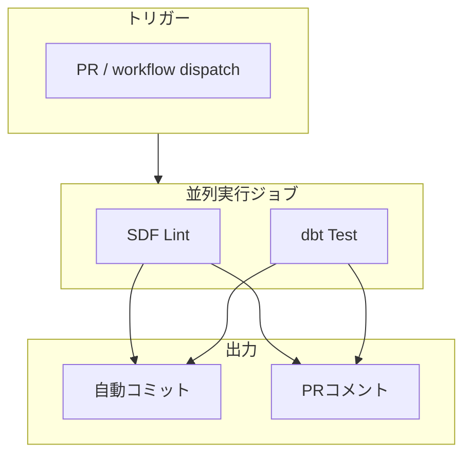

# 前置き
[dbt Advent Calender 2025](https://qiita.com/advent-calendar/2025/dbt) 12/22担当でしたが遅れてしまい失敬。  
業務中でなかなか腰を据えてdbtのCIを検討して組むタイミング無かったのでこのブログを機にやってみたいCIを一通り実装し検証してみましたのでその検討の内容を取りまとめました！

私からの遅めのクリスマスプレゼントです！ どうぞ🎁


# 概要

この記事では、dbtのCIについて以下必要だと考えられる処理全て詰め込んだ構成を検討しました。

- リンター・フォーマッター（SDF Lint）
- dbtの実行可能か（dbt build）
- データテスト
- ユニットテスト
- models.ymlの同期（dbt-osmosis）
- dbtプロジェクト構成違反検知（dbt_project_evaluator）

また、ここで重要になってくるのが都度の全実行だとCIとして非常に時間がかかるため**差分モデルのみに絞った処理（Slim CI）** を作ることを検討しています。

## 前提とする技術スタック

検証するに当たり以下のような技術スタックに則っています
- データ変換ツール: dbt-core
- DWH: BigQuery

# 今回考えたCIの構成

## CIの実行概念図



## CIごとの担当領域と出力内容

| ジョブ | 担当領域 | PRコメント | 自動コミット |
|--------|----------|------------|--------------|
| **sdf-lint** | SQL構文チェック・フォーマット | SDF Lint Results | フォーマット修正 |
| **dbt-test** | モデルビルド・テスト・構成チェック | Build Results / Evaluator Results | dbt-osmosis変更 |

# サンプルプロジェクトの構成

今回のCIを検証するため、GA4のサンプルデータを使ったディメンショナルモデリングのプロジェクトを構築しました。

## ソースデータ

- `bigquery-public-data.ga4_obfuscated_sample_ecommerce.events_*`

## モデル構成

```
models/
├── staging/
│   └── ga4/
│       └── stg_ga4__events.sql      # ソースの正規化
└── marts/
    ├── dim/
    │   ├── dim_users.sql            # ユーザーディメンション
    │   ├── dim_devices.sql          # デバイスディメンション
    │   ├── dim_geo.sql              # 地域ディメンション
    │   └── dim_apps.sql             # アプリディメンション
    └── fct/
        ├── fct_daily_engagement.sql # 日次エンゲージメント
        ├── fct_daily_access.sql     # 日次アクセス
        ├── fct_user_ltv.sql         # ユーザーLTV
        └── fct_session_summary.sql  # セッションサマリー
```

# CIの処理ごとに使った技術要素とその検討内容

## 1. SDF Lint（リンター・フォーマッター）
SDF は、マルチダイアレクト SQL コンパイラ、変換フレームワーク、そして分析データベースエンジンで、[2025年1月にdbt Labsに買収され](https://www.getdbt.com/blog/dbt-labs-announces-sdf-labs-acquisition)同年7月にこれをコアコンポーネントとした新しいエンジンのdbt-fusionが発表されました。

[SDF](https://www.sdf.com/)はRust製で上記のようにモダンな分析データベースエンジンとして開発されています。その機能の中に `sdf lint` という高速SQLリンター・フォーマッター機能を持ちます。dbt-coreで作られたdbtプロジェクトにも対応しています。  


### workspace.sdf.yml の設定
SDFの実行には、workspace.sdf.ymlが必要になります。  
以下が、dbt-coreとBigQueryに対応した設定になります。
```yaml
workspace:
  edition: '1.3'
  name: dbt_ci_test
  description: dbt ci test
  includes:
    - path: models
    - path: macros
      type: macro
  defaults:
    dialect: bigquery
    preprocessor: jinja

---
sdf-args:
  lint: >
    -w capitalization-keywords=consistent
    -w capitalization-literals=consistent
    -w capitalization-types=consistent
    -w capitalization-functions=consistent
    -w references-quoting
    -w structure-else-null
    -w structure-unused-cte
    -w structure-distinct
```

### CIでの実行フロー

1. `sdf format --save` でフォーマット適用
2. 変更があれば自動コミット
3. `sdf lint` でリント実行
4. 結果をPRコメントに投稿

```yaml
- name: Run SDF format
  run: |
    sdf format --save 2>&1 | tee sdf_format_output.txt

- name: Commit formatting changes
  run: |
    git add -A
    if git diff --staged --quiet; then
      echo "No formatting changes to commit"
    else
      git commit -m "style: auto-format SQL files with SDF"
      git push
    fi

- name: Run SDF lint
  run: |
    sdf lint 2>&1 | tee sdf_lint_output.txt
```

## 2. dbt build（Slim CI戦略）

### defer戦略とは

変更があったモデルとその下流のみをビルドし、上流モデルは本番環境のテーブルを参照する戦略です。

```
[本番環境]          [CI環境]
┌─────────┐
│ staging │ ◄───── defer で参照
└────┬────┘
     │
     ▼
┌─────────┐       ┌─────────┐
│  marts  │       │  marts  │ ← 変更があればビルド
└─────────┘       └─────────┘
```

### 実装のポイント
ここで重要になるのが、deferを機能させるために本番環境やステージング環境向けに生成された `manifest.json` を参照する必要があります。
そのファイル生成には様々な方法がありますがその中で比較的軽量に実現できるのが `dbt parse` による生成です。

また、会社の同僚に教えていただいた `dbt run` 実行時に `state:modified` を設定することで差分のあるモデルのみ実行することができるため都度の全実行を避けることが出来ます。
差分のあるモデルに依存するモデルがある場合は、 `state:modified+` と指定すれば下流のモデルまとめて実行するので変更の影響もまとめて確認することが出来ます。

それをまとめた内容が以下のステップでファイル生成とdeferを機能させた `dbt build` の実行の流れになります。
これにより、効率的にビルド済みのモデルを参照させながら変更差分のみ実行することでSlim CIを実現できます。

### selectors.yml での定義
CIの実行時にコマンドの設定値が複雑だったり都度変更が必要なのは変更と確認コストがかかります。
ここでも、社内の同僚に教えていただいたdbtのオプションで `selectors` というものが活躍します。

selectorsは、selectors.ymlというファイルを定義することで実行するモデルと実行しないモデルを定義し、かつその説明も記述できます。

selectorsを使った `dbt build` 範囲は `--selectors <name>` で指定でき `--select `と `--exclude` と該当するモデルの設定の記述を省略できます。  
これにより、チーム開発時に実行範囲の意図を伝えやすくCIでの実行コマンドをシンプルに保つことができます。

```yaml
selectors:
  - name: ci_slim
    description: |
      CI用: 変更されたモデルとその下流のみをビルド。
    definition:
      intersection:
        - method: state
          value: modified
          children: true
        - exclude:
            - method: package
              value: dbt_project_evaluator
```

### dbt build（Slim CI戦略） の実装

```yaml
# Step 1: prod manifestの生成
- name: Generate prod manifest
  run: |
    dbt parse --target prod
    mkdir -p prod_state
    cp target/manifest.json prod_state/manifest.json

# Step 2: 差分ビルド
- name: dbt build (slim CI)
  run: |
    dbt build \
      --selectors ci_slim \
      --defer \
      --state ./prod_state \
      --target ci
```

**重要なオプション：**

| オプション | 説明 |
|------------|------|
| `--selectors ci_slim` | selectorsを活用して変更されたモデルとその下流を選択と余計なモデル実行を避けた実行範囲の設定 |
| `--defer` | 上流モデルは本番環境を参照 |
| `--state ./prod_state` | 比較対象のmanifest.jsonの場所 |

## 3. dbt-osmosis（models.yml同期）

[dbt-osmosis](https://github.com/z3z1ma/dbt-osmosis)は、dbtモデルのスキーマ定義（YAMLファイル）を自動生成・同期するツールです。
このツールは以前から愛用しているのですがローカル実行に留まっており、チーム開発中でどうしても実行忘れをしがちなツールです。であれば、CIに入れれば良いのではないかと考え組み込んでみました。

### 差分ディレクトリのみ実行

```yaml
- name: Run dbt-osmosis yaml sync
  run: |
    MODIFIED_DIRS=$(git diff --name-only origin/main | \
      grep 'models/' | \
      xargs -I {} dirname {} | \
      sort -u)

    for dir in $MODIFIED_DIRS; do
      dbt-osmosis yaml refactor --fqn "$dir/"
    done
```

### dbt_project.yml での配置設定

```yaml
models:
  dbt_ci_test:
    staging:
      +meta:
        dbt-osmosis: "_{parent}__models.yml"
    marts:
      dim:
        +meta:
          dbt-osmosis: "_dim__models.yml"
      fct:
        +meta:
          dbt-osmosis: "_fct__models.yml"
```

## 4. dbt_project_evaluator（構成違反チェック）

[dbt_project_evaluator](https://github.com/dbt-labs/dbt-project-evaluator)は、dbtプロジェクトのベストプラクティス違反を検出するパッケージです。
このパッケージのお陰でSQLファイル単体のリンターや実行確認に留まらないプロジェクト全体の統制を取ることが可能になります。

このステップの実行の前にdbt-osmosisのステップを置くことでより単純なyamlファイルの同期の指摘を避けつつそれでもプロジェクトのルールを違反しているものを検知することができますのでそのようなステップの組み方をおすすめします。

### チェック項目

dbt-project-evaluatorは、以下のそれぞれの観点でベストプラクティスに沿っていないものを検知します

- **モデリング** - モデリングのベストプラクティスに則ったdbt DAGになっているか
- **テスト** - テストのベストプラクティスに沿ったモデルを作れているか 
- **ドキュメント** - ドキュメントのベストプラクティスに沿っているか
- **構造** - ファイル構造と命名に関するベストプラクティスのための dbt プロジェクト になっているか
- **パフォーマンス** - パフォーマンスのベストプラクティスのためのモデルのマテリアライゼーション戦略が取れているか 
- **ガバナンス** - モデルガバナンス機能のベストプラクティスに沿っているか

もちろん、このルール設定の変更は可能なのでチーム・プロジェクトごとにフィットしたものを設定しましょう。
より詳しい内容は、[dbt_project_evaluatorの公式docs](https://dbt-labs.github.io/dbt-project-evaluator/latest/)をご確認ください。

### dbt_project.yml での設定

```yaml
# テストの重大度を環境変数で制御
data_tests:
  dbt_project_evaluator:
    +severity: "{{ env_var('DBT_PROJECT_EVALUATOR_SEVERITY', 'error') }}"

# 命名規則のカスタマイズ
vars:
  dbt_project_evaluator:
    model_types: ['staging', 'intermediate', 'marts', 'other']
    staging_prefixes: ['stg_']
    intermediate_prefixes: ['int_']
    marts_prefixes: ['fct_', 'dim_']
```

# GitHub Actions ワークフロー全体像

## トリガー設定

```yaml
on:
  pull_request:
    branches: [main]
    paths:
      - 'dbt-ci-test/dbt_ci_test/models/**'
      - 'dbt-ci-test/dbt_ci_test/macros/**'
      - 'dbt-ci-test/dbt_ci_test/tests/**'
      - '.github/workflows/dbt-ci.yml'

  workflow_dispatch:
    inputs:
      target:
        description: 'dbt target (ci/dev/prod)'
        type: choice
        options: [ci, dev, prod]
      run_dbt_test:
        description: 'Run dbt Build & Test job'
        type: boolean
        default: true
      run_sdf_lint:
        description: 'Run SDF Lint job'
        type: boolean
        default: true
      run_evaluator:
        description: 'Run dbt Project Evaluator job'
        type: boolean
        default: true
      run_osmosis:
        description: 'Run dbt-osmosis yaml sync'
        type: boolean
        default: true
      full_build:
        description: 'Run full build (ignore defer)'
        type: boolean
        default: false
```

## PRコメント出力例

### SDF Lint Results

```markdown
# 🔍 SDF Lint Results

✅ All lint checks passed!

---
*Generated by dbt CI - SDF Lint*
```

### dbt Build Results

```markdown
# 🔨 dbt Build Results

## Models
✅ **8** models succeeded

## Data Tests
✅ **12** tests passed

## Unit Tests
ℹ️ No unit tests executed

---
*Generated by dbt CI - Build & Test*
```

### dbt Project Evaluator Results

```markdown
# 📊 dbt Project Evaluator Results

✅ All best practice checks passed!

**45** rules checked

---
*Generated by dbt CI - Project Evaluator*
```

# 作成したGithub Actionsの全体コード

https://github.com/cafenoctua/study_logs/blob/main/.github/workflows/dbt-ci.yml

# この検討中で浮かび上がった課題

## 1. SDF Lintの実用性

SDF Lintは高速で優れたツールですが、以下の課題があります：

- **Jinja関数の認識**: `ref()`, `source()` などのdbtマクロをエラーとして認識してしまう
- **回避策**: ダミーマクロを作成して対応が必要

```sql
-- macros/ref.jinja

{{ model_name }}

```

SQLFluffの利用を継続する必要がありそうです。

## 2. CI実行時間の懸念

都度の `dbt build` / `dbt_project_evaluator` の実行は重いため、PRへの変更のたびに実行するのが良いか疑問があります。

**改善案：**

- `push`時は `dbt test --select test_type:unit` のみ実行
- `pull_request`時に全テスト実行
- `dbt_project_evaluator` はマージ前の最終チェックのみ

## 3. PR数が多い場合のデータセット競合

複数のPRが同時に実行される場合、CIで使用するデータセットが競合する可能性があります。

**現在の対策：**

```yaml
env:
  DBT_BQ_DATASET: dbt_ci_${{ format('pr{0}', github.event.pull_request.number) }}
```

PR番号ごとにデータセットを分けることで競合を回避しています。

# 今後の展望

1. **SQLFluff との併用検討**: SDF Lintの制約を考慮し、SQLFluffとの使い分けを検討
2. **CI実行の最適化**: pushトリガーでは軽量なユニットテストのみ実行
3. **キャッシュの活用**: `dbt deps` の結果をキャッシュしてCI時間を短縮
4. **コスト監視**: BigQueryのクエリコストを可視化してCI実行コストを管理

# まとめ

本記事では、dbt CIの「全部入り」構成を実装しました。主なポイントは：

- **Slim CI戦略**: `state:modified+` と `--defer` で差分ビルドを実現
- **自動化**: SDF formatとdbt-osmosisによる自動コミット
- **構成チェック**: dbt_project_evaluatorでベストプラクティス違反を検出
- **可視化**: 全ての結果をPRコメントとして出力

実際の運用では、このCIの各ステップの実行を行うタイミングや設定値などがCI実行時間とチェックの網羅性のバランスにつながるのでそれを考慮しながら、プロジェクトに合った構成を選択することを推奨します。

それでは、皆さん良きdbt lifeを！

# 参考文献
- [dbt Labs Acquires SDF Labs to Introduce Robust SQL Comprehension into dbt and Supercharge Developer Efficiency](https://www.getdbt.com/blog/dbt-labs-announces-sdf-labs-acquisition)
- [dbt Docs: Set up CI](https://docs.getdbt.com/guides/set-up-ci)
- [dbt-project-evaluator](https://dbt-labs.github.io/dbt-project-evaluator/)
- [dbt-osmosis](https://github.com/z3z1ma/dbt-osmosis)
- [SDF - 1000x faster SQL linting](https://www.getdbt.com/blog/1000x-faster-sql-linting)
- [YAML Selectors](https://docs.getdbt.com/reference/node-selection/yaml-selectors)
