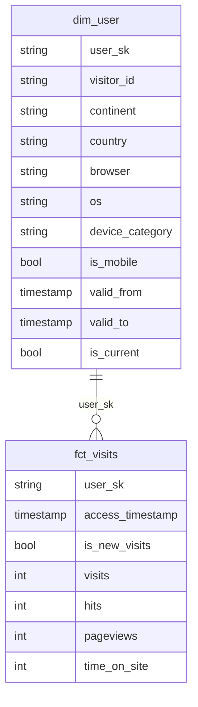

# このブログについて
このブログでは、データモデリングの実装で使われるsurrogate keyに必要性とそのメリットを説明します。
また、surrogate keyの良いと考えられる実装も合わせて説明していきます。

# 対象者
以下が対象者になります。
- データモデリングに入門した方
- surrogate keyの良い実装について考えている方

# 制限事項
このブログを書くうえで以下の条件の上で検証を進めました。
- DWH: BigQuery
- データ変換ツール: dbt

この条件外での検証と同様の結果を得られるとは限らないため各々の使う環境に合わせて調整ください。

# surrogate keyとは
特に分析、ビジネス利用上で意味を持たず、データモデリングの中で作られるカラムの一種です。
具体的にな利用用途としてはは、上述の通り以下の役割で使うのが基本的だと考えています。
- dimension tableは、primary key
- fact tableは、foreign key

また、実装は大まかに以下の流れで作られる
- dimension tableでsurrogate keyの値を計算する
- dimension tableと結合するfact tableがビジネスキー + surrogate keyの有効期間とfactのレコードのタイムスタンプが合致するものからfact tableにsurrogate keyを割り当てる

この実装ができればsurrogate keyは、dimensionでprimary key, factでforeign keyの役割で機能できるようになります。

dimension tableのsurrogate keyの計算方法は、複数あるため具体はsurrogate keyの形式は何が良い？にて説明します。

# 今回サンプルとして使うもの説明
ソースデータ:
`bigquery-public-data.google_analytics_sample.ga_sessions_*`
期間:
2016-08-01 ~ 2016-08-31

題材とするデータモデリング


このモデリングでは、以下の情報を表現します。
- dim_users: ユーザーディメンションとしてアクセスした地域や利用ブラウザーなどのユーザー情報を提供
- fct_visits: サイトに訪れたときに閲覧したページと滞在時間のメトリクスを持つ

ここでビジネスキーに当たるのはuser_sk、valid_from/toとis_current以外のすべてになります。

# surrogate key採用による得られるメリット
surrogate keyを実装することで以下のメリットが得られる

参考: [アジャイルデータモデリング 組織にデータ分析を広めるためのテーブル設計ガイド](https://www.amazon.co.jp/%E3%82%A2%E3%82%B8%E3%83%A3%E3%82%A4%E3%83%AB%E3%83%87%E3%83%BC%E3%82%BF%E3%83%A2%E3%83%87%E3%83%AA%E3%83%B3%E3%82%B0-%E7%B5%84%E7%B9%94%E3%81%AB%E3%83%87%E3%83%BC%E3%82%BF%E5%88%86%E6%9E%90%E3%82%92%E5%BA%83%E3%82%81%E3%82%8B%E3%81%9F%E3%82%81%E3%81%AE%E3%83%86%E3%83%BC%E3%83%96%E3%83%AB%E8%A8%AD%E8%A8%88%E3%82%AC%E3%82%A4%E3%83%89-KS%E6%83%85%E5%A0%B1%E7%A7%91%E5%AD%A6%E5%B0%82%E9%96%80%E6%9B%B8-%E3%83%AD%E3%83%BC%E3%83%AC%E3%83%B3%E3%82%B9%E3%83%BB%E3%82%B3%E3%83%AB/dp/4065330785) - 5.3.1
- ビジネスキーの変更をfactに影響を及ぼすことなく実行できる
- ビジネスキーをDWH上で統合することができる
- ディメンションとファクトで変化の粒度が異なる中でその間を結合を実現できる
- ビジネスキーの欠損値をステークホルダーによって定義された値を設定して取り扱うことができる
- マルチレベルディメンションに対応可能
    - ディメンションの中で複数のロールアップが可能(例: 製品→ブランド→カテゴリー)でどの情報まで細かく持っているを表現するカラム(レベルタイプ)を持つディメンション
    - ディメンションにさらなる柔軟性を与えるが同時に複雑性も増すため基本的にはシングルレベルディメンションを採用すべき
        - 必要な場合はFactの文書にML(マルチレベル)であることを明示する
- 匿名情報をもつビジネスキーを含んでいる場合に匿名化された情報から復号を防げる
- 複数のビジネスキーをfactで持たないで済むためテーブルサイズの縮小に貢献する
- 効率的な参照整合性を享受できる
    - 参照整合性とは
        - foreign keyが対応するprimary keyを持つことを意味する
        - これがないとforeign keyと一致しないprimary keyがある可能性を持つことになる
        - BQにもprimary key、foreign keyの結合最適化が可能: https://cloud.google.com/ブログ/ja/products/data-analytics/join-optimizations-with-bigquery-primary-and-foreign-keys/

# surrogate keyの形式は何が良い？

## 結論
BQをDWHとして採用している場合は、整数値surrogate keyはBQのベストプラクティスでも説明されている通りパフォーマンスが良いです。
https://cloud.google.com/bigquery/docs/best-practices-performance-compute?hl=ja#use_int64_data_types_in_joins

## 考えられる形式
### ビジネスキーから複合ユニークになる組み合わせをハッシュ化したキー
使える既存機能
- dbt_utilsが提供するハッシュ関数

### データ挿入順に連番で採番したキー
BQの整数型が持てる最大値はINT64型で約9EiBまでです
https://cloud.google.com/bigquery/docs/reference/standard-sql/data-types#integer_types

## surrogate keyをSTRING型とINT型の性能比較

ここで性能差が発生するのはfactとdimensionのjoinのためそれぞれを見てみる

STRING型によるsurrogate keyのjoin


STRING型のjoinは0.32sec

INT型によるsurrogate keyのjoin


INT型のjoinは0.21sec

このデータ量で1.5倍の性能差があることが分かりました。
(実行するタイミングで多少性能はブレるが複数実行して大体上記のような性能があるように見えています)


それぞれのタイプのテーブルの持つレコード数
| table type | recors |
| --- | ---
| dimension | 61872
| fact | 74759

# 整数値のsurrogate keyの実装について

以下の機能を持つよう実装すればsurrogate keyの実装として十分だと考えています。
- 新規追加されたレコードを過去の採番からの続きとなるようにする
- 過去surrogate keyが採番されたレコードでvalid_toの更新されるものがあるためそれを自己参照して更新をかける

### 新規追加されたレコードを過去の採番からの続きとなるようにする

実装ロジックは以下のようにすると良いと考えています。

- 自己参照して現在のsurrogate keyのmaxを取得
- 今回挿入するレコードを採番
- 自己参照したmax値と採番したレコードを足し算して挿入するsurrogate keyが作られる

具体なコードは以下を参考にしてください

https://github.com/cafenoctua/study_logs/blob/4d6c418de03d59f425915b90b4f3701c18e5753f/dbt-dimensional-modeling/dbt_dimensional_modeling/models/marts/dims/dim_users_sk_int.sql#L68-L73

### 過去surrogate keyが採番されたレコードでvalid_toの更新されるものがあるためそれを自己参照して更新をかける

実装ロジックは以下のようにすると良いと考えています

- 自己参照から現在値を取得(exp: is_currenct = true)
- 今回挿入するレコードとunionで結合
- ウィンドウ関数など用いて該当するグループでvalid_toの更新をする

具体なコードは以下を参考にしてください
https://github.com/cafenoctua/study_logs/blob/4d6c418de03d59f425915b90b4f3701c18e5753f/dbt-dimensional-modeling/dbt_dimensional_modeling/models/marts/dims/dim_users_sk_int.sql#L66-L103


# primary key/foreign key設定による参照の解除
データモデリングをしていく中でprimary key, foreign keyを設定できるようになります。
BQの機能としてもprimary keyとforeign keyを設定してクエリ最適化行うことができます。
https://cloud.google.com/ブログ/ja/products/data-analytics/join-optimizations-with-bigquery-primary-and-foreign-keys/

## 参照の解除とは
primary key, foreign keyの設定で参照の解除が行えるようになります。
参照の解除とは、クエリオプティマイザーが結合を不要と判断して、内部的に無駄な結合を排除することを指します。

## BQによる参照解除
参照の解除は以下のようにjoin(inner join, left join)の左辺のみ取得するときだけ実行可能です。
また、right joinの場合は右辺のみ取得で参照解除が実行されます。

```sql
select 
a.* except (user_surrogate key)
from
  {{ ref('fct_visits_surrogate key_int') }} as a
inner join
  {{ ref('dim_users_surrogate key_int') }} as b
on
  a.user_surrogate key = b.user_surrogate key
```


どちらも取得すると参照の解除は実行されず元の結合グラフで計算される

```sql
select 
b.* except (user_surrogate key),
a.* except (user_surrogate key)
from
  {{ ref('fct_visits_surrogate key_int') }} as a
inner join
  {{ ref('dim_users_surrogate key_int') }} as b
on
  a.user_surrogate key = b.user_surrogate key
```


その他参照解除の実験は以下参照
https://zenn.dev/cloud_ace/articles/bigquery-pk-fx-join-elimination

## BQのprimary key設定をdbtでできるか？
dbt-bigqueryのissueで既にディスカッション済みのようです。

https://github.com/dbt-labs/dbt-bigquery/issues/1016

結論、今回のようなより強い制約をサポートする計画は無いため対応されないと言及されています。
dbtとしては、constraintsを使うことを推奨しています。

これの代わりに、自分でpost_hookを使って設定が可能です。
例えば、以下はprimary keyを設定するdbt macroです。
https://github.com/cafenoctua/study_logs/blob/main/dbt-dimensional-modeling/dbt_dimensional_modeling/macros/set_primary_key.sql

このmacroをmodels.yamlに以下のように仕込めばpost_hookでprimary keyを設定してくれるようになります。

https://github.com/cafenoctua/study_logs/blob/4d6c418de03d59f425915b90b4f3701c18e5753f/dbt-dimensional-modeling/dbt_dimensional_modeling/models/marts/dims/_dim_users_sk_int.yml#L8-L9

foreign keyも同様に実装すれば良いです。

# まとめ
ここで分かった事よりsurrogate keyは、実装によって持つデータサイズとクエリパフォーマンスに影響を与えること分かりました。
DWH(BQ)の機能を向上はキー設計で可能なため皆さんもキー設計するときは、ぜひこちらの内容も参考しつつ適宜検証いただくのが良いと思います。